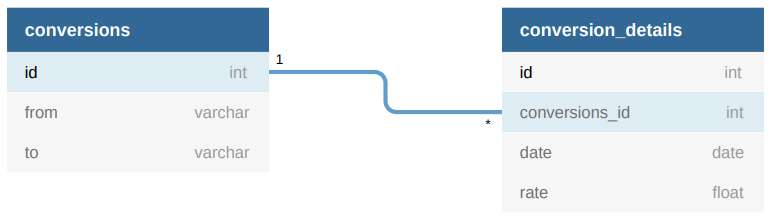

# Foreign Currency BE Exercise

## Database Design



There are 2 tables, which are CONVERSIONS and CONVERSION_DETAILS
The relationship between these two are CONVERSIONS has_many CONVERSION_DETAILS, and CONVERSION_DETAILS belongs_to CONVERSIONS
Every detail in CONVERSION_DETAILS refers to CONVERSIONS by using the conversions_id

## How-to

### How to run the program

1. Run the apps by using docker-compose:
    ```
    docker-compose up -d --build
    ```